

  

  
  
  
  

Table of Contents

- [Description](#description)
- [Built with](#built-with)
- [Usage](#usage)
  - [Preparation](#preparation)
  - [Main page](#main-page)
  - [Catalog page](#catalog-page)
  - [Cards](#cards)
  - [Pagination](#pagination)
  - [Filters](#filters)
  - [Favorites page](#favorites-page)
- [Contributing](#contributing)

## Description

Carspace is the web application for one click car rental created using React and Redux libraries.
On this page you can do the folowing:

- View various cards with information about cars for rental
- Load more cards by clicking on a button to see other options
- learn more about those you are interested in
- Search cars by model, price per hour and/or mileage
- Add selected car to your favorites

Here's a little demonstration of this website features

## Built With

  

## Usage

### Preparation

For start you just need to navigate to a github pages website using [This Embedded Link](https://neyrosick.github.io/car-rent-app-react/), or link located in description of the repo.

### Main Page

First and foremost, upon following the link, you'll be directed to the `main page`:

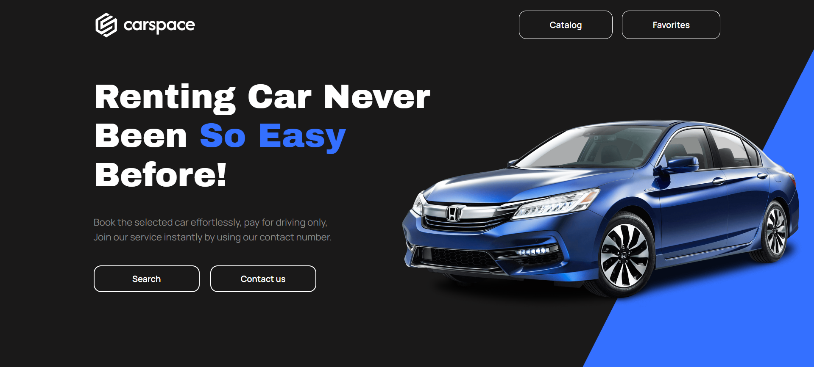

You can `contact` the owner here, navigate to the `catalog page`, or explore your `favorites`. Since no cards with cars have been added to favorites yet, let's go to the catalog page. By the way, by clicking on `Search` button you'll be also moved to the catalog.

### Catalog Page

The first thing you'll encounter on the catalog page is the `filter bar`, accompanied by numerous `cards` featuring diverse car images and corresponding information about each vehicle.

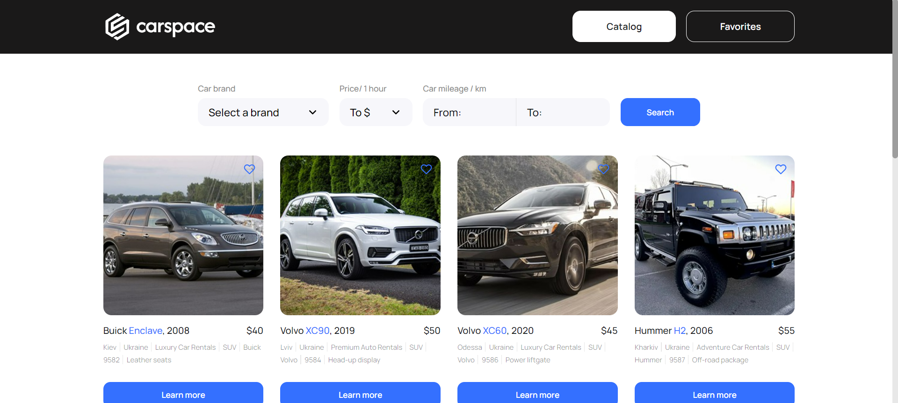

### Cards

Inside each card you can see information about specific car, such as brand, model, year of manufacture and price for rental per hour. In addition, you can click `Learn more` to see detailed information.

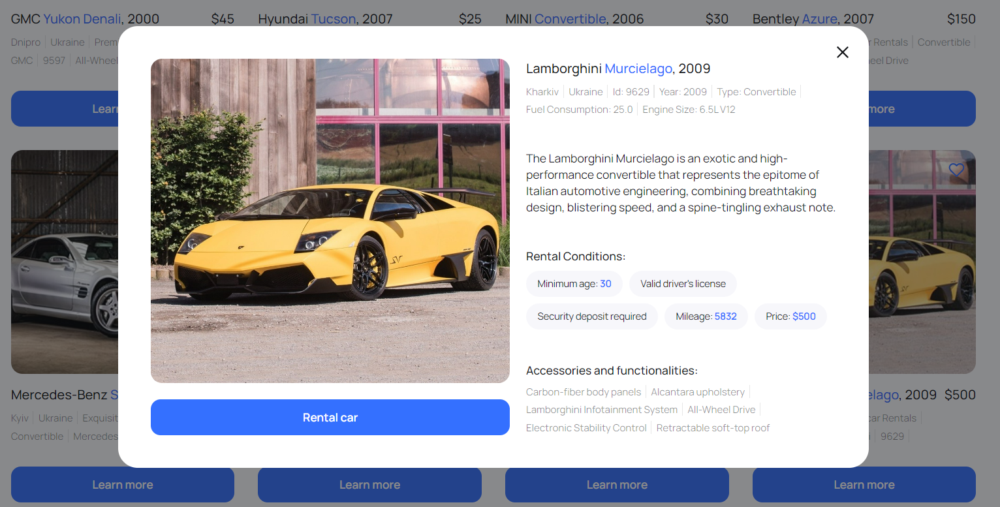

### Pagination

If there's not enough сar options available, you can click on `Load more` to increase amount of cards displayed on your sreen

  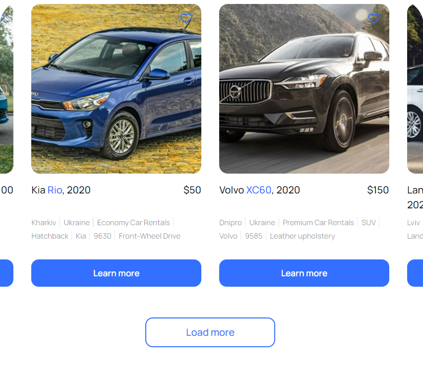
  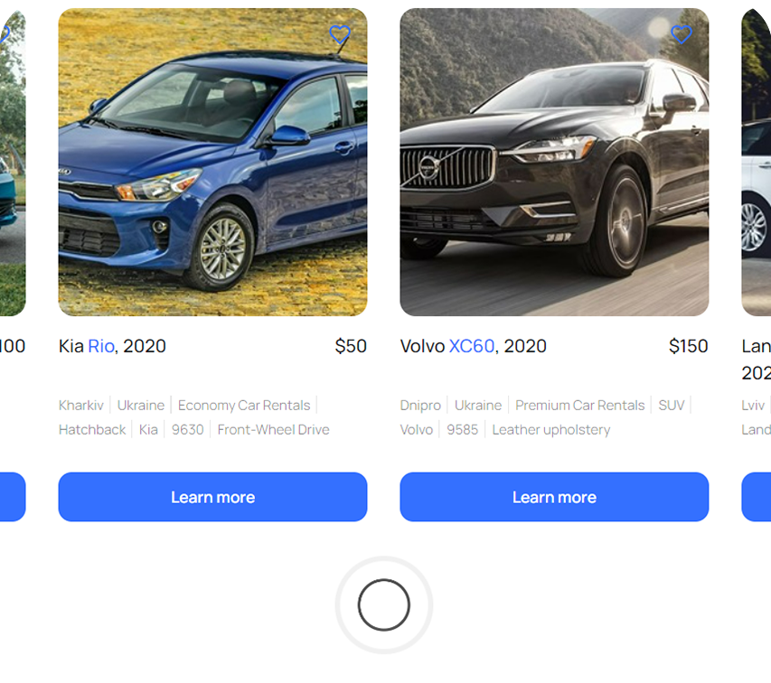
  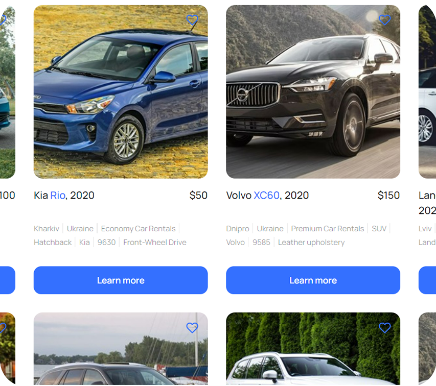

Pagination works for every page in the website also including `filtered list` in catalog page.

### Filters

If you want to find needed car quickly and precisely you should use a `filter bar`

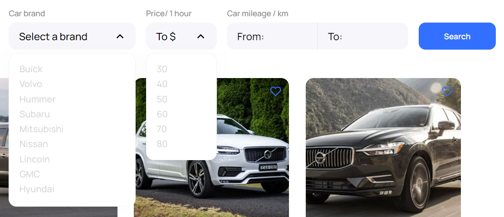

As you can see you have three filter options to choose from: `car brand`, `price per hour` limitation and `mileage`. You can choose multiple filters at once or just one at a time.

After selecting filters and clicking the `search` button, you can now view the search results and ensure that everything is working correctly. By clicking on the button browser sends api request to the https://mockapi.io backend server db with collection of documents with car information.

If car with specified parameters exist in the backend database, you will see succesful result of the search.

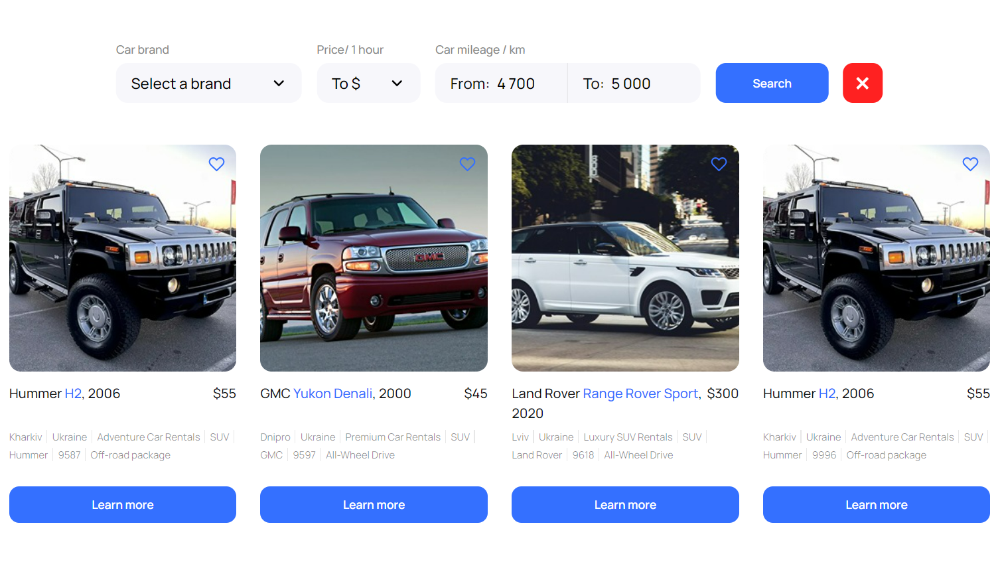

If conditions are oposite you will receive next warning message

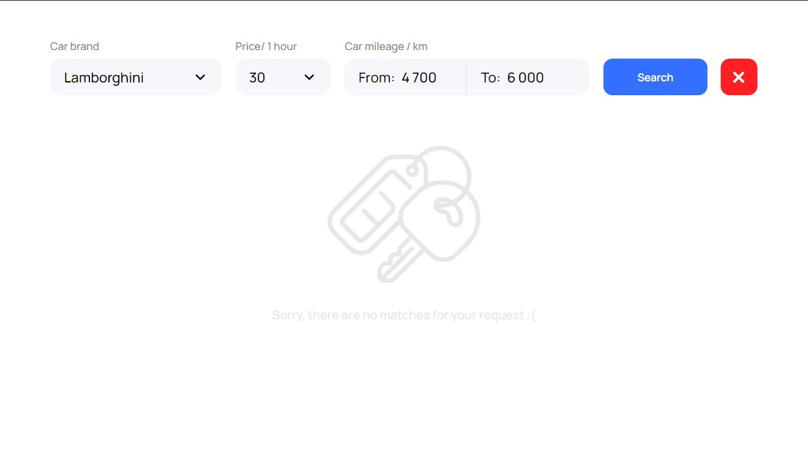

If you no longer wish to use filters, `filter clear` button was added. Simply click on that button to return to the default, unfiltered list of cars.

If you find a car for rent that interests you and want to save the search results or `share` them with someone, simply `copy` the `address bar link`. When the recipient follows the link, they will immediately see the results of your search.

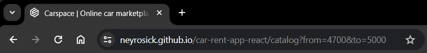

This logic has been implemented using React search-params hook and such implementation works for `favorites page` too.

### Favorites page

When you find a car interesting but are still hesitant between several options, you can easily add a car to your favorites. Simply click on the small heart button located in the top right corner of the vehicle card then navigate to the `favorites page` in the website header section.

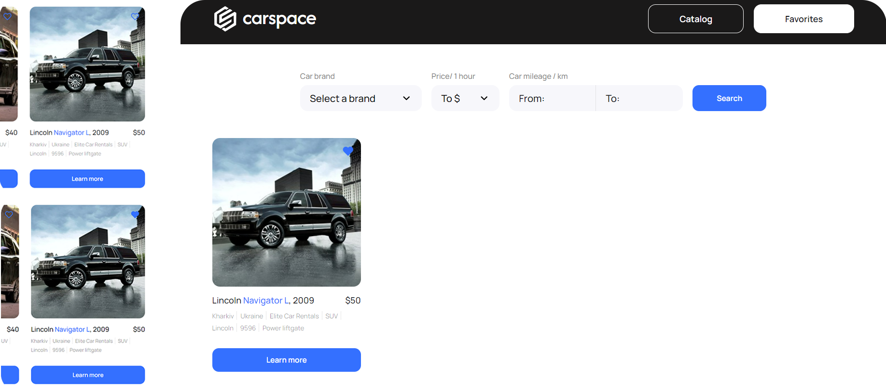

As you can see over time amount of favorite cars can grow and it will be hard to distinct if it is catalog page or favorites page, so styles for `active page` in header navigation was added.

When you no longer want certain car in your favorites simply click on heart button in card again to `remove` it from favorites page. If there's no items on favorite page, or filter results was unsuccesful you will encounter next message

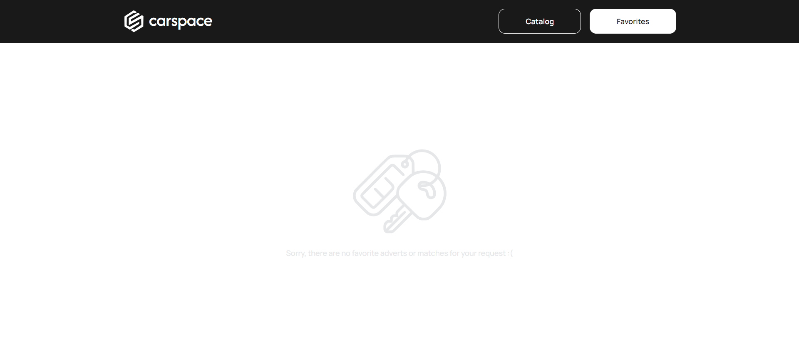

## Contributing

  <a href="https://github.com/neyrosick/car-rent-app-react/issues/new?assignees=&labels=bug&template=01_BUG_REPORT.md&title=bug%3A+">Report a Bug</a>
  ·
  <a href="https://github.com/neyrosick/car-rent-app-react/issues/new?assignees=&labels=enhancement&template=02_FEATURE_REQUEST.md&title=feat%3A+">Request a Feature</a>
  ·
  <a href="https://www.linkedin.com/in/danylohatak/">Ask a Question</a>

First off, thanks for taking the time to contribute! Contributions are what makes the open-source community such an amazing place to learn, inspire, and create. Any contributions you make will benefit everybody else and are greatly appreciated.

Please try to create bug reports that are:

- _Reproducible._ Include steps to reproduce the problem.
- _Specific._ Include as much detail as possible: which version, what environment, etc.
- _Unique._ Do not duplicate existing opened issues.
- _Scoped to a Single Bug._ One bug per report.

Your contributions are always welcome

  <a href="#description">(Back to top)</a>

